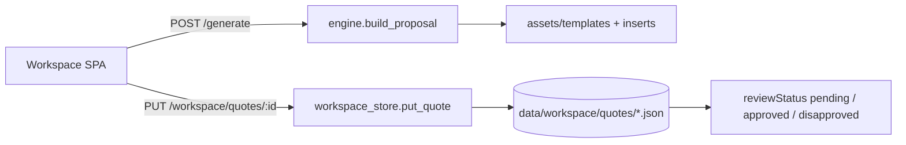

# Proposal engine architecture

Flask service that builds WEOTT proposal PDFs and stores shared workspace quotes.

Workspace quote JSON includes costing snapshot plus `reviewStatus` and `reviewedAt`. A save that omits `reviewStatus` keeps the previous approval so costing edits do not wipe a review.
